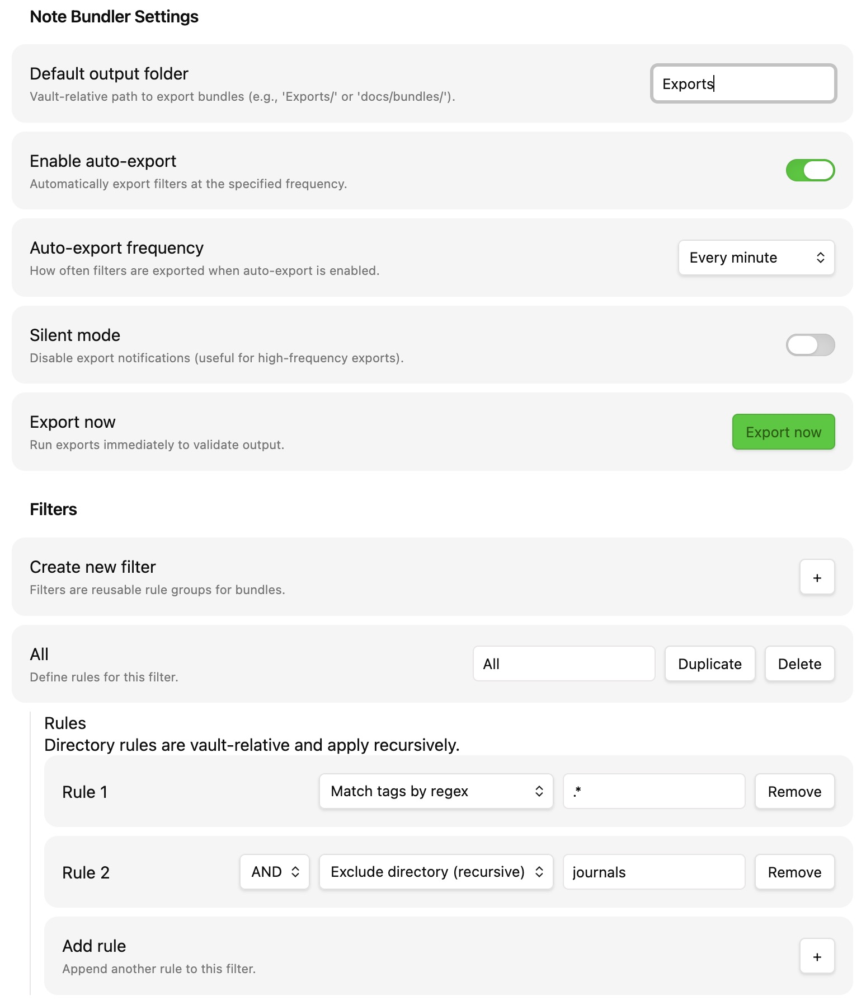

# Note Bundler

Export filtered Obsidian notes into consolidated Markdown files. Perfect for preparing LLM context, documentation packages, or curated note collections.

## Features

- Tag-based filtering with regex support (include/exclude patterns)
- Directory include/exclude rules (recursive, vault-relative)
- AND/OR logic to combine multiple rules
- Manual and scheduled auto-exports (minute/hour/day intervals)
- Vault-relative or absolute output paths (desktop only)
- Cross-platform compatibility
- Device-specific settings (independent configs per device)



## Installation

1. Clone this repository
2. `npm install && npm run build`
3. Copy `main.js` and `manifest.json` to `.obsidian/plugins/note-bundler/` in your vault
4. Enable in Obsidian → Settings → Community plugins

**Development**: Symlink the repo folder into `.obsidian/plugins/note-bundler` and run `npm run dev`.

## Usage

### 1. Configure Output Location
**Settings → Note Bundler → Default output folder**  
Use vault-relative paths like `Exports/` or `docs/bundles/`. On desktop, you can also use absolute paths like `/Users/john-doe/Documents/NoteBundles/`.

### 2. Create Filters
1. Click **Create new filter**
2. Name it (e.g., "Project Notes")
3. Add rules:
   - **Match tags by regex** - Include matching notes
   - **Exclude tags matching regex** - Exclude matching notes
   - **Include directory (recursive)** - Include notes inside a vault-relative folder
   - **Exclude directory (recursive)** - Exclude notes inside a vault-relative folder
4. Combine rules with AND/OR operators

**Tag regex examples:**
- `#project` - exact tag
- `#project.*` - tags starting with #project
- `#(important|urgent)` - multiple tags

N.B. Tags are not treated as case-sensitive (e.g., `#Project` and `#project` are the same), so you don't need to worry about case in the regex - it will pick up both.

**Directory rule examples (vault-relative):**
- `journals/` - everything in `journals/` and subfolders
- `Projects/ClientA` - only that subtree (case-sensitive)

### 3. Export
**Manual:** Click **Export now** in settings  
**Auto:** Enable auto-export and choose frequency (minute/hour/day)

## Output Format

```markdown
# Notes combined on: 2026-01-19 12:00:00

---

# Note title: Project Overview

Project overview content with **formatting** and [[links]] preserved.

---

# Note title: Research Notes

Research findings and citations...
```

## Device-Specific Settings

Each device maintains independent plugin settings automatically - no sync conflicts. Configure different export paths and schedules per device without any setup.

## Development

Symlink the repo folder into `.obsidian/plugins/note-bundler` and run `npm run dev` for live development with hot reloading.

## Troubleshooting

- **Export fails**: Check output path permissions
- **No notes exported**: Verify filter rules and tag spelling
- **Auto-export not running**: Check plugin permissions
- **Debugging**: Check developer console, test with simple patterns first

## Contributing

Contributions welcome! Fork, create a feature branch, and submit a PR.

## License

GPL-3.0 - see [LICENSE](LICENSE) for details.

## Changelog

See `CHANGELOG.md` for version history and updates.
